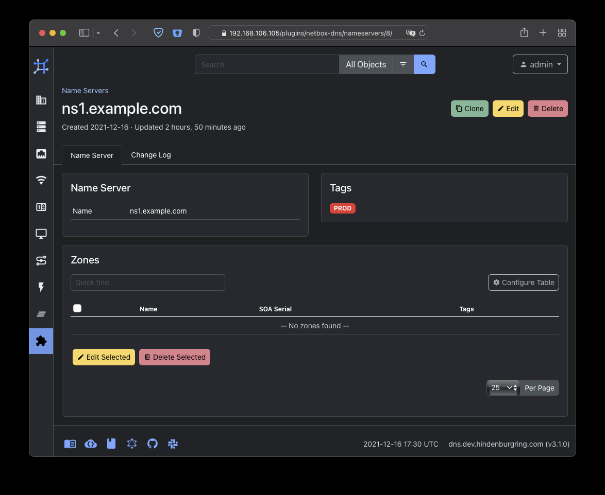
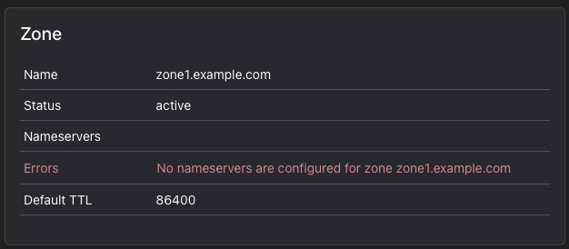
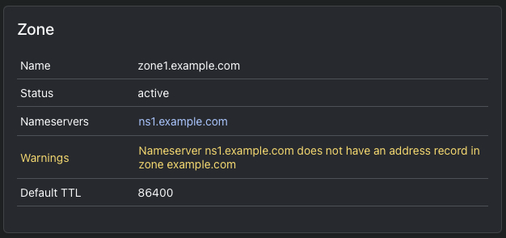
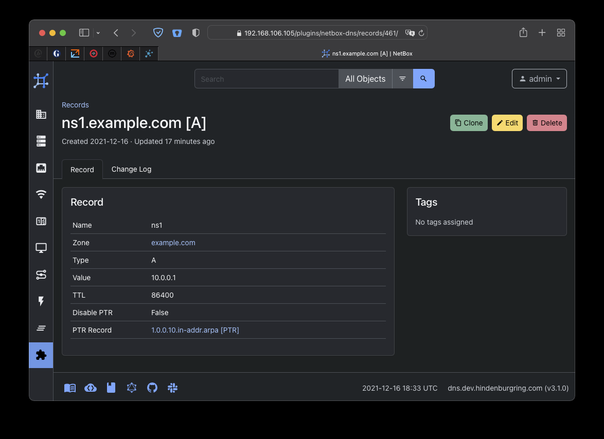
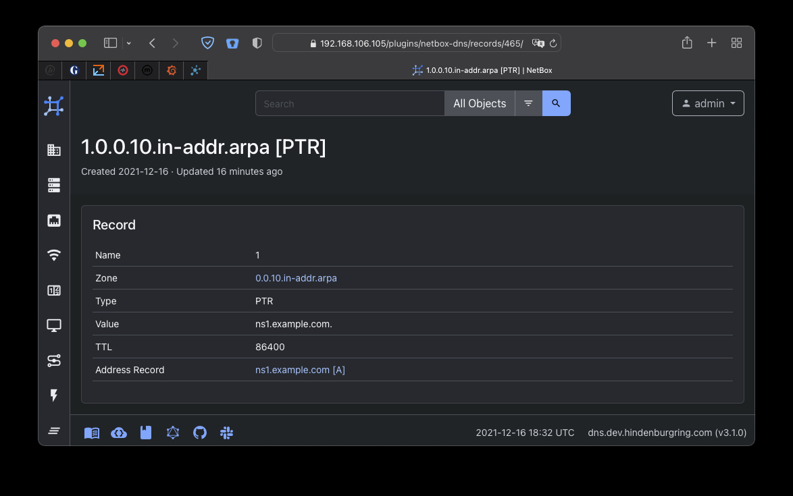
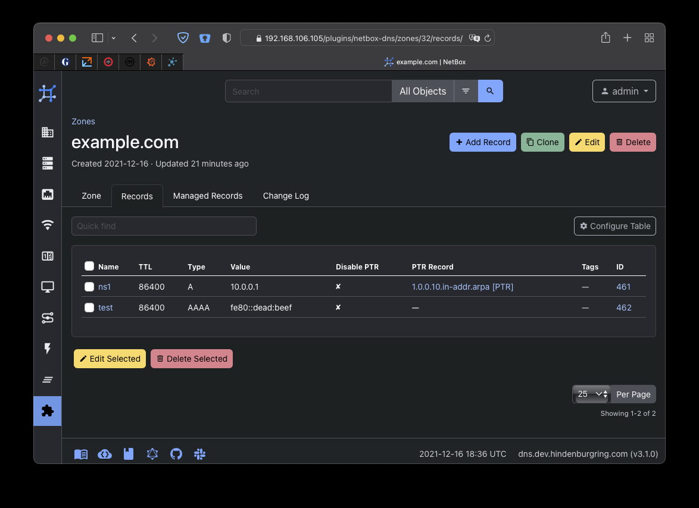
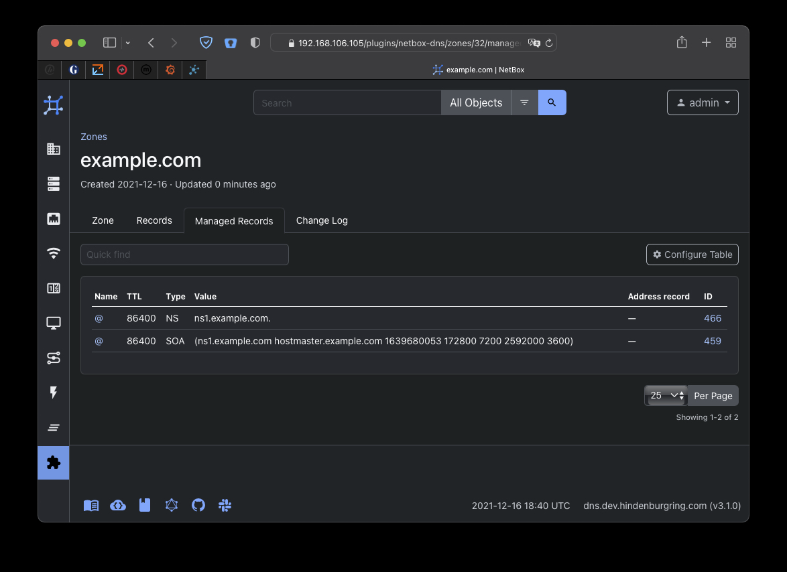

# Using Netbox DNS
Netbox DNS is a plugin for Netbox designed to manage DNS data. In the current version it supports Name Server, Zone, and Record objects for simple DNS deployments. Its main features include:

* Generation of the NS records for a zone from the assigned Name Server objects as defined in [RFC 1035, Section 3.3.11](https://datatracker.ietf.org/doc/html/rfc1035#section-3.3.11)
* Generation of the SOA record for a zone from the component fields defined in [RFC 1035, Section 3.3.13](https://datatracker.ietf.org/doc/html/rfc1035#section-3.3.13)
* Optional management of PTR records for A and AAAA records if the reverse zones are also in Netbox DNS
* Optional generation and update of the SOA serial number for a zone if zone data or data of any record within the zone is updated
* API endpoints that can be used to export Name Server, Zone and Record data
* Basic integrity checks of the entered data

## Installation and Configuration
The installation of plugins in general is described in the [Netbox documentation](https://netbox.readthedocs.io/en/stable/plugins/).

### Requirements
The installation of Netbox DNS requires a Python interpreter and a working Netbox deployment. Supported versions are currently:

* Netbox 3.0 or higher
* Python 3.7 or higher

### Installation of Netbox DNS
Netbox DNS is available as a PyPi module and can be installed using pip:

```
$ source /opt/netbox/venv/bin/activate
(venv) $ pip install netbox-dns
```
This will install Netbox DNS and all prerequisites within the Netbox virtual environment.

### Adding Netbox DNS to the local Netbox requirements
To have Netbox DNS updated when a Netbox update is performed, include it in the local requirements file for Netbox:

```
echo netbox-dns >> /opt/netbox/local_requirements.txt
```
If the local requirements file does not exist, this command will create it.

This will ensure that Netbox DNS will be updated every time the update script provided with Netbox is executed.

### Running the Django database migration procedure
Netbox DNS requires some tables for its data models within the Netbox database. Execute the following command to create and update these tables:

```
/opt/netbox/netbox/manage.py migrate
```
Now Netbox DNS should show up under "Plugins" at the bottom of the left-hand side of the Netbox web GUI.

## Object types
Currently Netbox DNS can manage three different object types: Name Servers, Zones, and Records.

### Name servers
Names erver objects correspond to name servers in the DNS infrastructure and are basically fully qualified domain names (FQDN) of hosts running name server instances. 

A Name Server object is required for a zones MNAME field in the SOA record, defining the primary server for the zone data, and for NS records inside each zone, defining the name servers that are serving as data sources for a zone's authoritative information. The primary name server is not necessarily one of the authoritative name servers.

Without any name servers in the system, zones cannot be defined as a name server object is strictly required for the SOA MNAME field, so at least one name server must be defined before adding zones or records to Netbox DNS.

Optionally, name servers can be tagged using standard Netbox tags. Tags must be defined in Netbox before they can be assigned to any object.

Name servers that are in use by zones for their SOA MNAME field cannot be deleted.

#### Permissions
The following Django permissions are applicable to Name Server objects:

Permission                     | Action
----------                     | ------
`netbox_dns.add_nameserver`    | Create new name server objects
`netbox_dns.change_nameserver` | Edit name server information
`netbox_dns.delete_nameserver` | Delete a name server object
`netbox_dns.view_nameserver`   | View name server information

To use tags, the `extras.view_tag` permission is required as well.

#### Fields
For name servers the following fields are defined:

Field     | Required | Explanation
-----     | -------- | -----------
**Name**  | Yes      | The fully qualified domain name (FQDN) of the name server. 
**Tags**  | No       | Netbox tags assigned to the name server. Tags can be used to categorise name servers by arbitrary criteria such as Production/Test/Development systems.

A name server detail view:



### Zones
Zone objects correspond to DNS zones to be served. Each zone contains resource records (RRs) of various types and zone specific configuration information that affects how the zone data is propagated and cached.

#### Permissions
The following Django permissions are applicable to Name Server objects:

Permission               | Action
----------               | ------
`netbox_dns.add_zone`    | Create new zone objects
`netbox_dns.change_zone` | Edit zone information
`netbox_dns.delete_zone` | Delete a zone object
`netbox_dns.view_zone`   | View zone information

To use tags, the `extras.view_tag` permission is required as well.

#### Generic Fields
The following fields are defined for every zone object:

Field           | Required | Default  | Explanation
-----           | -------- | -------  | -----------
**Name**        | Yes      |          | The name of the zone. This is an FQDN that represents the DNS domain containing host names to be resolved or one of the special zones `in-addr.arpa` or `ip6.arpa`, which are reserved for the resolution of IPv4 and IPv6 addresses by the DNS infrastructure
**Status**      | Yes      | Active   | The zone's status. Possible values are "active", "reserved", "deprecated" or "parked". All zone status except "Active" are considered inactive, which has implications for the records in a zone as well as for PTR records in reverse zones that are automatically generated for address records in the zone.
**Nameservers** | No       | see [Default Settings](#config)) | The list of authoritative name servers for the zone
**Default TTL** | Yes      | see [Default Settings](#config)) | The default TTL for all records in the zone if none is specified
**Tags**        | No       |          | Netbox tags assigned to the zone. Tags can be used to categorise zones by arbitrary criteria.

##### Zones without name servers

While the "Nameservers" list for a zone is not strictly required, zones without any name server records cannot be loaded by DNS servers. The detail view of a zone without any name servers shows an error message alerting the user of this fact.



This will make zone data exported from Netbox DNS unusable unless name servers are added before trying to load that zone.

##### Zones with unresolved name servers

Likewise, if a zone has nameservers defined, the name servers have domain names within a zone managed by Netbox DNS, and the name of the name server cannot be resolved within that zone, a warning message for every name server affected by this is displayed in the zone detail view.



This will result in problems notifying secondary name servers of zone updates, although generally the zone data is valid.

#### SOA fields
Zone specific data is maintained in the zone's "Start of Authority" (SOA) record. That record contains the following fields in the specified order:

SOA Field     | Explanation
---------     | -----------
**TTL**       | The time to live for the SOA record.
**MNAME**     | The FQDN of the primary name server for the zone 
**RNAME**     | The mailbox of the person responsible for the zone. Note that the "@" in the e-mail address used here has to be replaced by a dot ".".
**SERIAL**    | An unsigned 32 bit number indicating the current state of the zone on the primary name server
**REFRESH**   | A 32 bit time interval in seconds that indicates the interval after which the zone should be refreshed from the upstream name server
**RETRY**     | A 32 bit time interval in seconds that indicates how long a name server should wait before retrying a failed refresh attempt
**EXPIRE**    | A 32 bit time interval in seconds that indicates the duration after which a zone that cannot be refreshed is no longer authoritative
**MINIMUM**   | A 32 bit time interval in seconds that is to be used as the default time to live (TTL) for records served from the zone. Note that this affects both positive and negative (NXRRSET) lookups

The zone's SOA record is assembled from these fields by contatenating them and putting them in parentheses. Netbox DNS creates the SOA record automatically from the information entered in the fields above.

All SOA fields are required. Default settings can be configured in the Django configuration file, see [Default Settings](#config)).

#### Automatic SOA SERIAL generation
SOA SERIAL fields are crucial for the propagation of zone data from primary name servers to secondaries, as the process involves checking the zone's serial number on the secondary against the serial number on the primary and only performing the update when the primary has a higher serial number or the interval specified in the SOA EXPIRE field has passed.

This is especially important when PTR records are automatically created from A and AAAA records and an update to a forward zone thus can lead to one or several reverse zones being updated behind the scenes as well. 

For that reason, Netbox DNS has the option of automatically creating SOA SERIAL numbers when zones or records within them change. This is controlled by the `Generate SOA Serial` checkbox in the zone create and edit views. If that check box is ticked, the serial number of the zone is calculated as maximum of the Unix epoch times (seconds since January 1st, 1970 00:00 UTC) of the last change to any records and the zone itself. 

If the checkbox is not ticked, the SERIAL field is mandatory and the user is responsible for keeping track of zone changes. Netbox DNS will not touch the serial of that zone in any case.

A zone in detail view:


#### <a name="config"></a>Default settings
Zone default settings can be configured in the plugin configuration of Netbox. The following settings are available:

Setting                 | Variable               | Factory Default
-------                 | --------               | ---------------
**Nameservers**         | `zone_nameservers`     |
**Default TTL**         | `zone_default_ttl`     | 86400 
**Generate SOA Serial** | `zone_soa_serial_auto` | True
**SOA MNAME**           | `zone_soa_mname`       |
**SOA RNAME**           | `zone_soa_rname`       |
**SOA SERIAL**          | `zone_soa_serial`      | 1
**SOA REFRESH**         | `zone_soa_refresh`     | 172800
**SOA RETRY**           | `zone_soa_retry`       | 7200
**SOA EXPIRE**          | `zone_soa_expire`      | 2592000
**SOA MINIMUM**         | `zone_soa_minimum`     | 3600

The settings can be set or overridden in the file `/opt/netbox/netbox/netbox/configuration.py` by defining new values in `PLUGINS_CONFIG` as follows:

```
PLUGINS_CONFIG = {
    'netbox_dns': {
        'zone_nameservers': ['ns1.example.com', 'ns2.example.com'],
        'zone_soa_mname': 'ns1.example.com',
        'zone_soa_rname': 'hostmaster.example.com',
    },
}
```

After changing the configuration, Netbox must be restarted for the changes to take effect.

### Records
Record objects correspond to resource records (RR) that within zones. Netbox DNS differentiates between records maintained by the user and so-called "Managed Records", which are created by Netbox DNS itself and cannot be edited manually. Currently there are three types of managed records:

* SOA records are created from the SOA data for a zone
* NS records are created from the name servers aasigned to a zone
* PTR records are created in reverse zones (zones ending `in-addr.arpa` or `ip6.arpa`) from address records in other zones.

There is exactly one SOA record per zone, so SOA records cannot be created manually at all. NS and PTR records do not have that kind of restriction and can be created and maintained manually if they have not been created by Netbox ("Managed Records'), although that should also be required in special cases.

#### Permissions
The following Django permissions are applicable to Name Server objects:

Permission                 | Action
----------                 | ------
`netbox_dns.add_record`    | Create new record objects
`netbox_dns.change_record` | Edit record information
`netbox_dns.delete_record` | Delete a record object
`netbox_dns.view_record`   | View record information

To use tags, the `extras.view_tag` permission is required as well.

#### Fields
For records the following fields are defined:

Field           | Required | Explanation
-----           | -------- | -----------
**Zone**        | Yes      | The zone in which the record is to be defined
**Type**        | Yes      | The type of the resource record. This can be one of a list of record types derived from [RFC 1035, Section 3.3](https://datatracker.ietf.org/doc/html/rfc1035#section-3.3), e.g. A or AAAA
**Disable PTR** | Yes      | A checkbox indicating whether a PTR record should be generated for an A or AAAA record automatically if there is a zone suitable for the PTR in Netbox DNS
**Name**        | Yes      | The name of the record, e.g. the simple host name for A and AAAA records
**Value**       | Yes      | The value of the record, e.g. the IPv4 or IPv6 addreess
**TTL**         | No       | The time to live for the record. Defaults to the zone's default TTL
**Tags**        | No       | Netbox tags assigned to the name server. Tags can be used to categorise name servers by arbitrary criteria such as Production/Test/Development systems
**Active**      | N/A      | This field is not an input field, but it is created from the zone status. Records in zones not marked as "Active" are themselves marked as inactive (the boolean field value is False). Managed PTR records that have been created from inactive A or AAAA records are marked inactive as well.

#### Automatic generation of PTR records
For the address record types A and AAAA, Netbox DNS can automatically generate and maintain the corresponding PTR records. For this to work, the following conditions must be met:

* The corresponding `in-addr.arpa` or `ip6.arpa` zone must be present in Netbox DNS
* The "Disable PTR" field must not be set to False (default is True)

If, for instance, there is a zone `0.0.10.in-addr.arpa` is defined in Netbox DNS and an address record is created in a forward zone `example.com` with the address `10.0.0.1`, the corresponding PTR record will be created in the former zone as the reverse RR name for the IPv4 address `10.0.0.1` is `1.0.0.10.in-addr.arpa`.

If another A record with the same IPv4 address as its value is created, Netbox DNS will not accept it as the PTR record must be unique. In that case, the "Disable PTR" flag must be set for one of the A records.

If the reverse zone does not exist in Netbox DNS, it will not be created automatically as it is not certain that the authority for that zone lies with the user. If, however, a matching reverse zone is created later on, the PTR records for all A or AAAA records in Netbox DNS that match the new reverse zone will be created automatically (unless "Disable PTR" is set for a record).

Changing the name and/or value of an A record results in updating, moving or deleting the corresponding PTR record. Deleting an A record results in the corresponding PTR record getting deleted as well. 

A record detail view for a standard record:



A record detail view for a managed record:



Note that for managed records there are no buttons for deleting, editing or cloning them as they cannot be managed manually. Otherwise they are handled exactly like standard records.

#### Displaying records
Records can either be displayed by opening the record list view from the "Reocrds" or "Managed Records" navigation item on the left, or per zone via the respective tabs in the zone defail view. In any case, the tables can be filtered by name, value, zone, or tags to narrow down the set of records displayed.

The list of standard records for a specific zone using the "Records" tab in the zone detail view:



The list of managed records for a specific zone using the "Managed Records" tab in the zone detail view:


